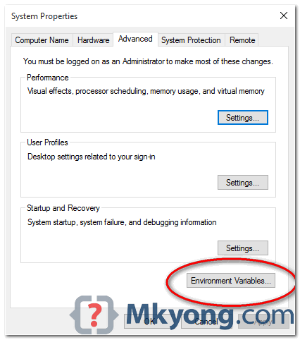
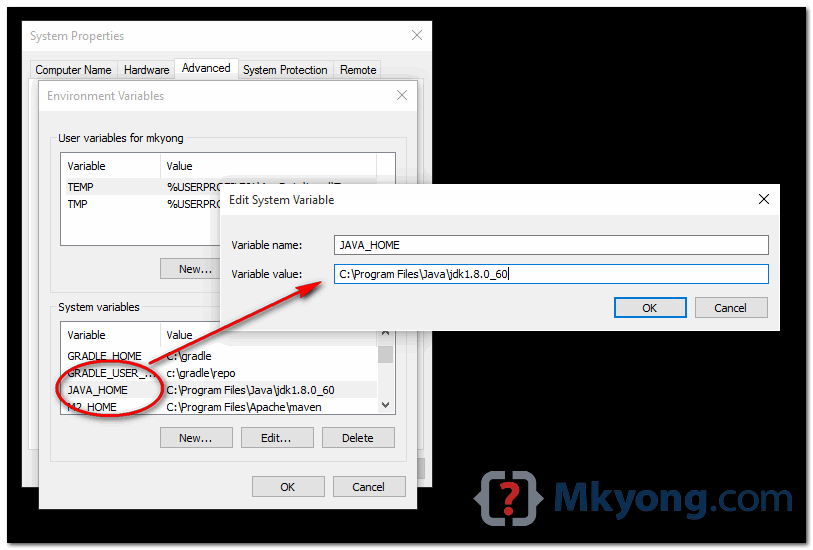
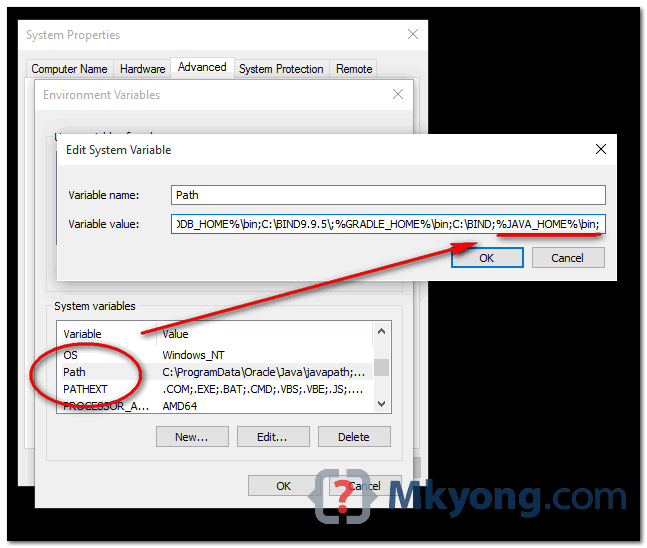
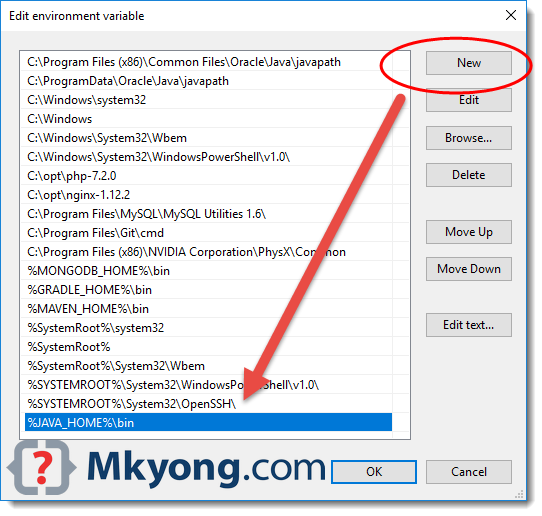

## Pyspark Read S3 From Local

### Prerequesite
* java jdk 1.8.0
* python 3.6
* spark-2.3.2-bin-hadoop2.7.tgz
* hadoop-aws-2.7.0.jar
* aws-java-sdk-1.7.4.jar
* winutils.exe
* hadoop.dll
  
### Installation
* First you must have local that already installed with java jdk 1.8.0 and python, 
  **if you can't or never install java and python just search it on google**
    
  

#### Install Spark
* Download spark on https://archive.apache.org/dist/spark/, haha because thats work for me.
  i dont know exactly which suitable version library org.apache.hadoop:hadoop-aws and 
  com.amazonaws:aws-java-sdk for latest spark version.
  
* extract spark-2.3.2-bin-hadoop2.7.tgz to whatever do you want to store for example
  `C:\\spark-2.3.2-bin-hadoop2.7\`
  
* create folder hadoop on previous folder like 
  `C:\\spark-2.3.2-bin-hadoop2.7\hadoop`
  
  
#### Set Configuration additional files on spark
* Download jar library aws-java-sdk and hadoop-aws on https://mvnrepository.com/
  
* Download winutils.exe and hadoop.dll on https://github.com/steveloughran/winutils
  please use same version hadoop with spark that you used , for example:
  spark-2.3.2-bin-hadoop2.7 you must download winutils with folder 2.7.x
  because it used hadoop 2.7
  
* put **hadoop-aws-2.7.0.jar** and **aws-java-sdk-1.7.4.jar** on `C:\\spark-2.3.2-bin-hadoop2.7\jars`
  
* put **hadoop.dll** on `C:\\spark-2.3.2-bin-hadoop2.7\hadoop` and `C:\Windows\System32`
  
* put **winutils.exe** on `C:\\spark-2.3.2-bin-hadoop2.7\hadoop`
  
#### Set up systems Variable for java, python and spark
* then type `Edit the system variable environtments` on search box besides 
  Windows start button
    
* Select `Advance` tab, clicks `Environment Variables`
  
    
* In System variables, clicks New... button to add a new `JAVA_HOME` variable and point it to the JDK installed folder.
  
    
* In System variables, find PATH, clicks edit... button :
  for old version of Windows, it will prompt you below dialog box to edit the values directly, 
  append this `%JAVA_HOME%\bin;` to the end of the line.
  
    
* In latest Windows 10, it will prompt you below dialog box, clicks on New button, and add this `%JAVA_HOME%\bin`
  
  
    
* Open a command prompt, type :
  <pre>C:\Users\162624.rejanuis>java -version 
  java version "1.8.0_301"
  Java(TM) SE Runtime Environment (build 1.8.0_301-b09)
  Java HotSpot(TM) 64-Bit Server VM (build 25.301-b09, mixed mode)
  
  C:\Users\162624.rejanuis>javac -version
  javac 1.8.0_281
  
  C:\Users\162624.rejanuis>echo %JAVA_HOME%
  C:\Program Files\Java\jdk1.8.0_281</pre>

* Do same step for python, find your python path installation.
  <pre>C:\Users\162624.rejanuis\AppData\Local\Programs\Python\Python36
  C:\Users\162624.rejanuis\AppData\Local\Programs\Python\Python36</pre>
  put those two lines in System variables and Path
  
* then do same step too for **`SPARK_HOME, PYTHONPATH, HADOOP_HOME`**
  <pre>SPARK_HOME=C:\\spark-2.3.2-bin-hadoop2.7
  HADOOP_HOME=C:\\spark-2.3.2-bin-hadoop2.7\hadoop
  PYTHONPATH=%SPARK_HOME%/python;%SPARK_HOME%/python/lib/py4j-0.10.9-src.zip;%PYTHONPATH%</pre>
  just put that three lines in System variables and Path
  

#### Run The Script
* Finally, after a long way you can start running your spark script on local machine
just run <pre>python3.6 sparkreads3.py</pre> or you can directly run with IDE tools

#### References
* https://mkyong.com/java/how-to-set-java_home-on-windows-10/
* https://towardsdatascience.com/installing-apache-pyspark-on-windows-10-f5f0c506bea1